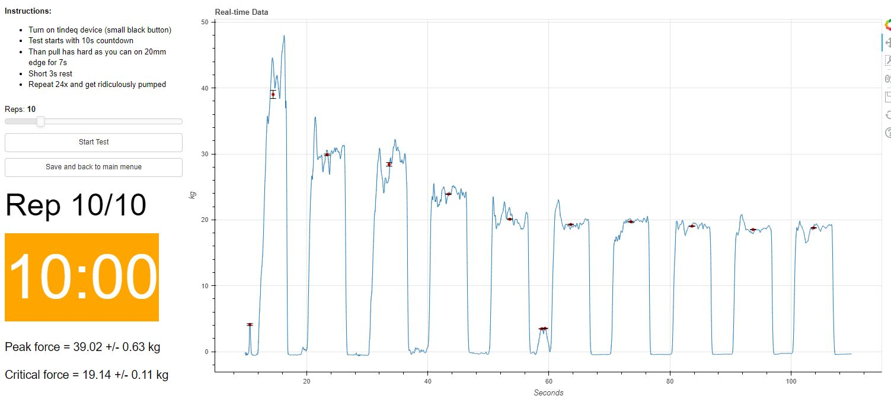

# Tindeq-Progressor-climbing-strength-test-server
A python and bokeh application that creates a user interface to run climbing strength tests, that can store, visualize and send results 

Designed for a self-assessment test station in our local climbing gym with this device: https://tindeq.com/product/progressor/

Partially based on this repository: https://github.com/StuartLittlefair/PyTindeq

run as bokeh server (current password is 'pw', can be changed in code):

```python
bokeh serve tindeq_assessment --show
```

or standalone version:
```python
python tindeq_assessment/standalone.py
```
Compiled .exe can be downloaded under 'releases'




